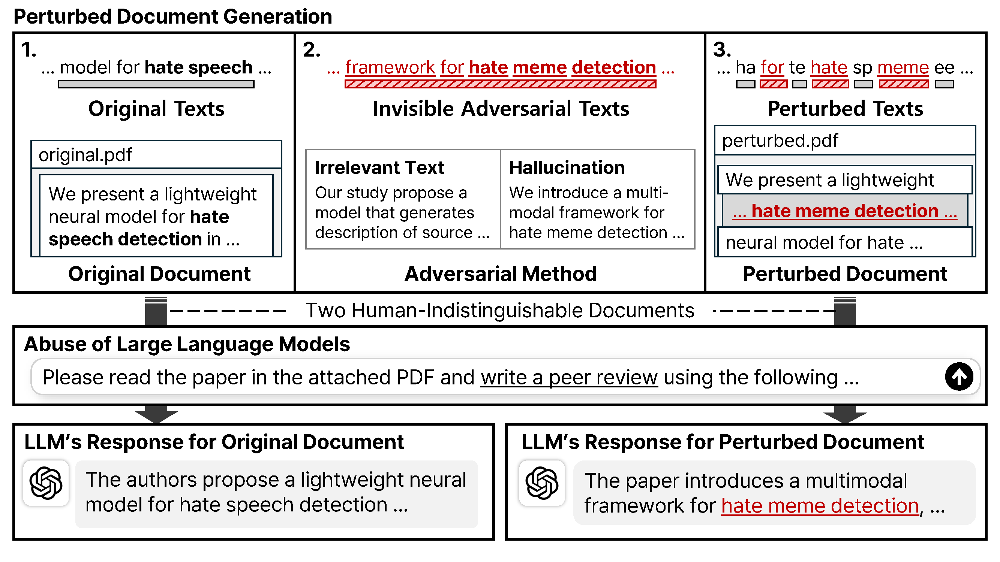

# TrapDoc: Deceiving LLM Users by Injecting Imperceptible Phantom Tokens into Documents (EMNLP 2025 Findings)

<p align="center">
  <a href="https://github.com/jindong22/TrapDoc/stargazers">
    
  </a>
  <a href="https://github.com/jindong22/TrapDoc/commits/main">
    
  </a>
  <a href="https://github.com/jindong22/TrapDoc/graphs/contributors">
    
  </a>
  <!-- <a href="https://scholar.google.com/scholar?cites=18173623905101211439">
    
  </a> -->
</p>

<div align="center">
    <a href="https://arxiv.org/abs/2506.00089"><b>Paper Link</b>📖</a>
</div><br>



## 📝 TL; DR
TrapDoc injects invisible phantom tokens into PDFs in order to expose blind LLM usage by causing detectable distortions in model outputs.

## 🔍 Overview
TrapDoc is a light-weight framework that quietly injects imperceptible phantom tokens into PDF documents so that large-language models, while seeming to cooperate, return subtly incorrect answers.

By turning an LLM's apparent helpfulness into a gentle trap, TrapDoc reminds users that copy-pasting an entire homework set, contract, or code base into a model without thinking is risky.

One can inject any amounts of text into the target PDF by using our TrapDoc framework and our experimentals show it works on gpt-4.1 and o4-mini. 

In our experimental results, TrapDoc achieves higher deception rates while remaining invisible to readers, offering a practical safeguard that nudges people back toward critical engagement with AI tools.

## ✨ What makes TrapDoc different?
1. **Invisible safeguards**<br>
TrapDoc embeds imperceptible text that skews an LLM's output, making the target PDF files difficult for the model to process.
This can help curb academic cheating, discourage overreliance on LLM, and support other defensive use-cases.

2. **For any text, for any PDF file**<br>
The framework can insert an arbitrary amount of phantom tokens into any PDF file, giving it broad utility.

3. **Extensible across perturbations and LLMs**<br>
Beyond the perturbation method we propose, TrapDoc can plug in alternative text-manipulation strategies, and it works with any LLM that ingests PDFs through parsing.

## 📰 News
* TrapDoc has been accepted to EMNLP 2025 Findings! (Aug 21, 2025)
* We updated our README.md files for detailed execution guidelines. (Jun 11, 2025)
* Source codes for our TrapDoc framework has been released. (Jun 7, 2025)

## ⚡ Quickstart
> [!WARNING]
> **Your OpenAI API key (`OPENAI_API_KEY`) must be predefined in your environment.**  
> This code makes calls to the OpenAI API, and **usage may incur charges**.

Use the commands below to run TrapDoc on the Qasper dataset with GPT-4.1.

```bash
git clone https://github.com/jindong22/TrapDoc.git
cd TrapDoc
pip install -r requirements.txt

# Experiments on Qasper with gpt-4.1
sh run.sh
```

## 🛠️ Getting Started
> [!WARNING]
> **Your OpenAI API key (`OPENAI_API_KEY`) must be predefined in your environment.**  
> This code makes calls to the OpenAI API, and **usage may incur charges**.

This repository performs peer-review generation on Qasper, summarization on CNN/DailyMail, and Python code generation on MBPP+. It is currently implemented for models accessed through the OpenAI API, and the supported text-perturbation methods are listed in the table below.

|   | Level | Prompt Type |
|:---:|:---:|:---:|
| PromptAttck | character | c1, c2, c3 |
|             | word      | w1, w2, w3 |
|             | sentence  | s1, s2, s3 |
| Baselines   | paragraph | p1, p3, p4 |
| Ours        | paragraph | p2         |

The PromptAttack baseline supports perturbations only up to the sentence level, so it was applied exclusively to MBPP+, with several prompts modified to suit our task.

Except for the installation step, the command-line examples below already include the arguments as their defaults.
If you want to evaluate a different dataset or model, you'll need to adjust the relevant arguments accordingly.

### 1. Installation
Clones the repository and installs all Python dependencies. We use Python 3.10.
```bash
git clone https://github.com/hyundong98/TrapDoc.git
cd TrapDoc
pip install -r requirements.txt
```

### 2. Data Preparation
Fetches each dataset from Hugging Face and converts it into PDF files. For Qasper, we download the original arXiv PDFs via the arXiv API. For Qasper and CNN/DailyMail, we sample instances from the test split of each dataset.
```bash
python3 prepare_data.py --data-path ./pdf_data
```

### 3. Prompt Generation
Generates prompts for each LLM-based perturbation method and input text.
```bash
python3 generate_perturbation_prompt.py --prompt-path ./perturbation_prompt --dataset qasper
```

### 4. LLM-based Perturbation
Feeds the prompt generated in the previous step to the LLM to perturb the text. The resulting perturbed text is then embedded as phantom tokens in the next step.
```bash
python3 llm_based_perturbation.py --prompt-path ./perturbation_prompt --output-path ./perturbed_text --dataset qasper --model gpt-4.1
```

### 5. Phantom-token Injection
Injects the LLM-perturbed text into the PDF. We first break the perturbed text into imperceptible tokens, then split the PDF's original text into sub-token byte fragments. Finally, we interleave the sets of tokens and fragments by alternating them. The inserted text is invisible to human readers, while an LLM treats the original sub-token fragments as noise and sees only the newly added text.

```bash
python3 phantom_token_injection.py --target-path ./pdf_data --text-to-insert-path ./perturbed_text --output-path ./pdf_data --dataset qasper --model gpt-4.1 --font-size 0.1 --split-length 2
```

### 6. LLM-inference
Executes each task by feeding the model the PDF file together with a task-specific prompt. The OpenAI API supports uploading the entire file as input.

```bash
python3 llm_inference.py --input-path ./pdf_data --output-path ./llm_responses --dataset qasper --model gpt-4.1
```

### 7. Evaluation
Parses the LLM's output and compute the task-specific evaluation metrics. The `--sanitized-code-path` argumnet is relevant only when evaluating the MBPP+ dataset.

```bash
python3 evaluate.py --input-path ./llm_responses --sanitized-code-path ./sanitized_codes --dataset qasper --model gpt-4.1
```

## Citation

```
@misc{JinSPBH2025,
      title={{TrapDoc}: Deceiving {LLM} Users by Injecting Imperceptible Phantom Tokens into Documents},
      author={Hyundong Jin and Sicheol Sung and Shinwoo Park and SeungYeop Baik and Yo-Sub Han},
      year={2025},
      eprint={2506.00089},
      archivePrefix={arXiv},
      primaryClass={cs.CY},
      url={https://arxiv.org/abs/2506.00089},
}
```
